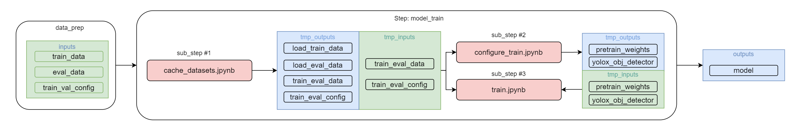

# Step CV-Pipeline: model_train

Данная компонент CV-Pipeline предназначен для конфигрурирования тренировки модели, загрузка predtraining весов и запуск обучения модели

Создается на основе [шаблона](https://github.com/4-DS/step_template).
Чтобы не забывать про обязательные ячейки в каждом ноутбуке, проще всего создавать новые ноутбуки просто копированием [`substep_full.ipynb`](https://github.com/4-DS/step_template/blob/main/substep_full.ipynb) из стандартного [шаблона](https://github.com/4-DS/step_template) компоненты.

Конечным выходом работы данного step CV-Pipeline является
- **model**     
Сохраненные веса обученной модели (веса последней эпохи и с лучшими достигнутыми метриками), конфигурационные файлы

## Add sinara

### clone repository 
```
git clone https://gitlab.com/yolox_mmdet/model_train.git
cd data_load
```  

### add sinara module  
```
git submodule add https://github.com/4-DS/sinara.git sinara
```  

### init DSML module  
```
git submodule init
```

### update to latest DSML module
```
git submodule update --remote --merge